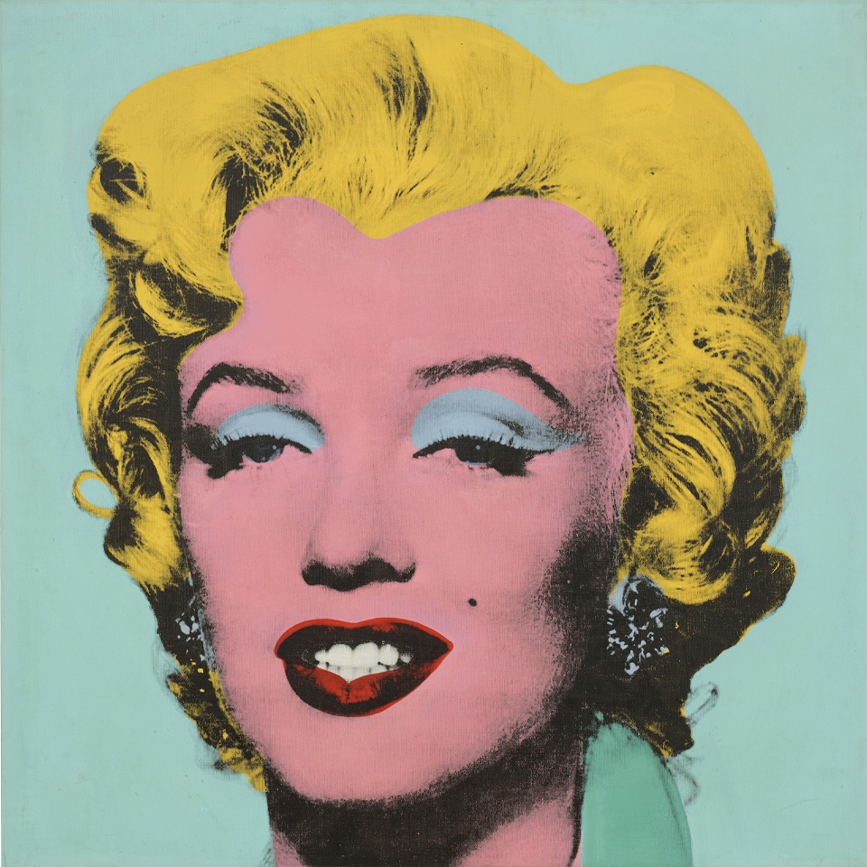
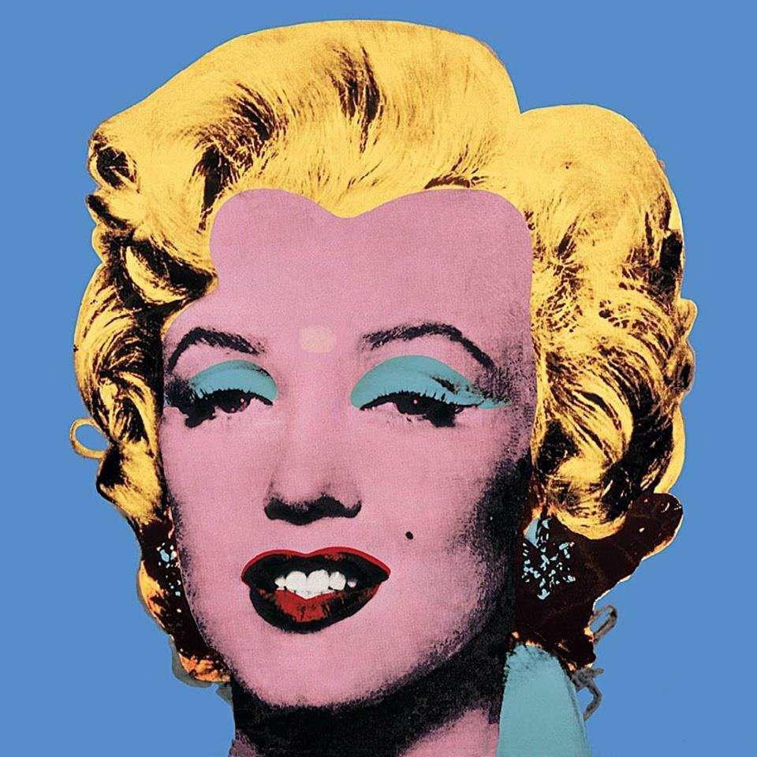
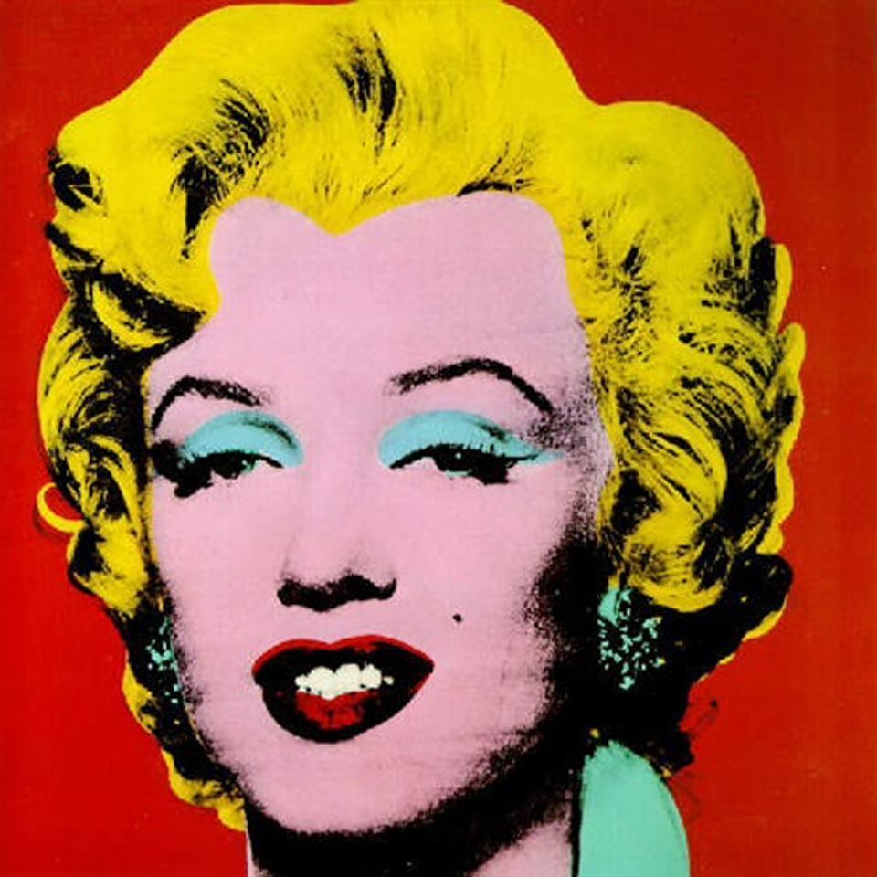
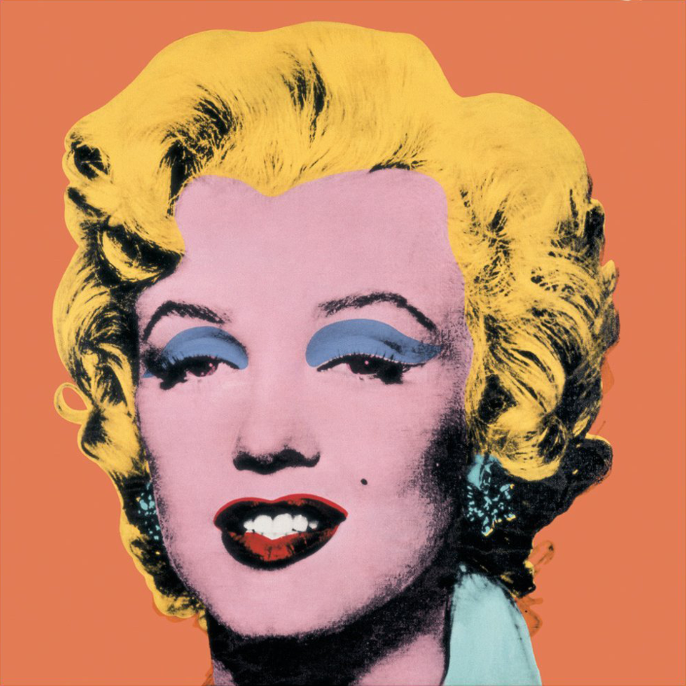
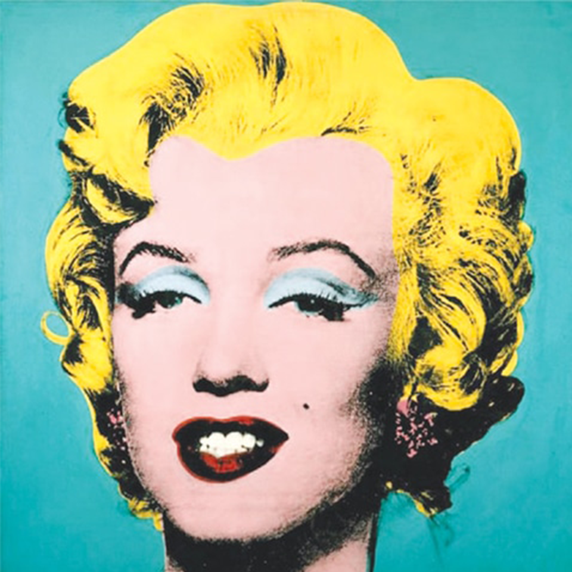

# STA160 Final: Analyzing Andy Warhol's "Shot Marilyn" Paintings

In this project, we analyze the five images of Andy Warhol's "Shot Marilyn" paintings from 1964. We compare the colors and outlines across the four paintings: Light Blue, Sage Blue, Red, Orange, and Turquoise.

## Steps:

1. **Conversion from JPG to PNG:**
   - The original JPG images are converted into PNG format to preserve image quality and transparency.

2. **Histogram of Distribution of Pixel Values:**
   - We plot histograms to visualize the distribution of pixel values in each image.
   - This helps us understand the color composition and intensity variations within the paintings.

3. **Color Extractions:**
   - We extract the dominant colors from each painting using color analysis techniques.
   - This provides insights into the overall color palettes used in the artwork.

4. **Canny Edge Detection - Image Outline:**
   - We apply the Canny edge detection algorithm to highlight the outlines of the paintings.
   - This helps in understanding the composition and structural elements of the artwork.

By analyzing the colors and outlines across the "Shot Marilyn" paintings, we gain a deeper understanding of Andy Warhol's artistic choices and the visual impact of these iconic pieces.

Please refer to the corresponding code and images in this repository for a detailed analysis.

## Images:

The following images are included in this analysis:

- Light Blue
- Sage Blue
- Red
- Orange
- Turquoise

For each image, we have provided the converted PNG version, histograms showing the distribution of pixel values, color extractions, and Canny edge detection results.

## References:
[1] Color Extraction Tutorial: [Link to documentation](https://towardsdatascience.com/image-color-extraction-with-python-in-4-steps-8d9370d9216e)

